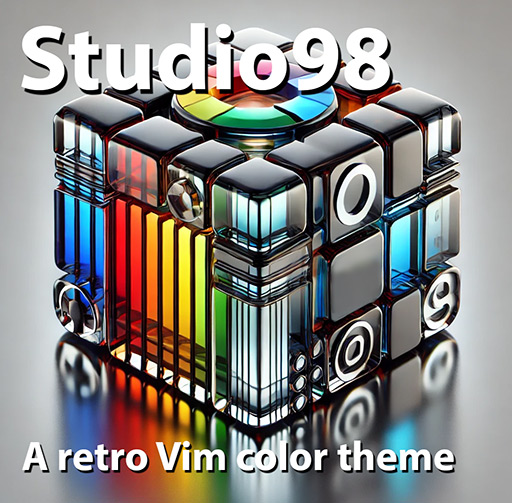

# Studio98



Studio98 is a Vim colorscheme inspired by the Visual Studio 6.0 era on Windows 98/NT—back when editors were simple, fast, and got out of the way. It’s built for focus, with a bright white background and high-contrast syntax highlighting that makes code instantly readable. No trendy low-contrast themes, no distractions—just clear, sharp text that keeps you locked into the code.

If you learned programming like me in the ’90s, these colors will feel familiar. They’re wired into muscle memory, making it easy to navigate and think without hesitation.

Studio98 is for those who want a simple, effective color scheme that doesn’t fight for attention—because the focus should be on the code, not the editor.

I've also designed it to work on terminals. The contrast remains strong, and nothing disappears into the background. A white background isn’t just great for a GUI—it can also work well in a terminal window, making text stand out clearly even in lower-color environments.

## Screenshots


Font: Monaspace Neon


Font: Courier New


Pop-Up Menu


Development Environment

## Installation

### Manual Installation
1. Download `studio98.vim` and place it in your Vim colors directory:
   ```sh
   mkdir -p ~/.vim/colors
   cp studio98.vim ~/.vim/colors/
   ```
2. Add the following to your `vimrc`:
   ```vim
   colorscheme studio98
   ```
3. Restart Vim and enjoy!

## Modification

This colorscheme was built using **vim-colortemplate**, a simple and efficient
way to create Vim colorschemes. If you want to tweak Studio98 or create your
own themes, check it out:

🔗 [vim-colortemplate](https://github.com/lifepillar/vim-colortemplate)

The template to generate `studio98.vim` is found in the folder:

    template/studio98.colortemplate

Don't modify `studio98.vim` directly.

## Author

2025 Jan Zwiener

