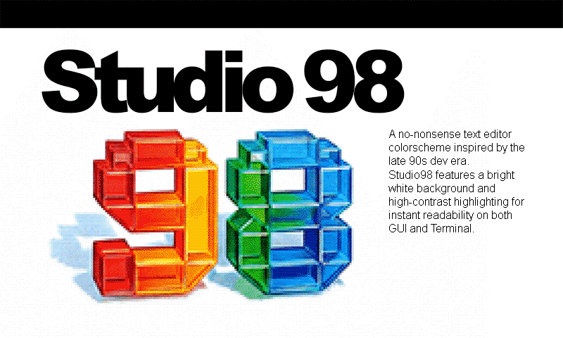
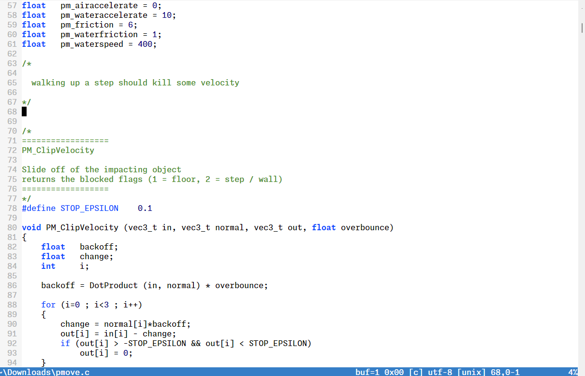
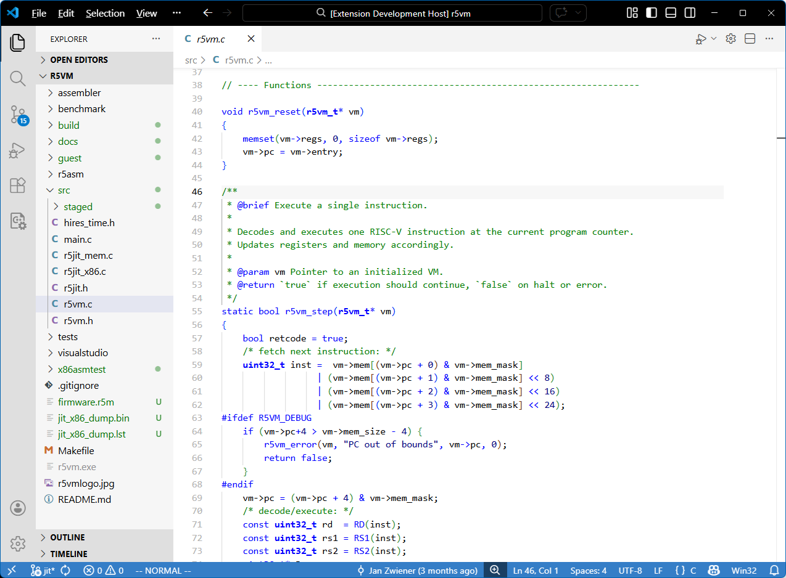
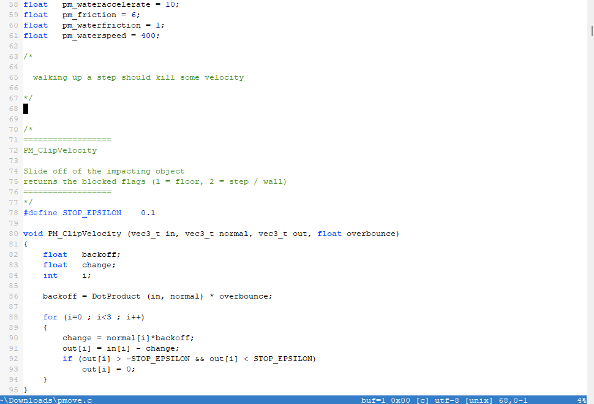
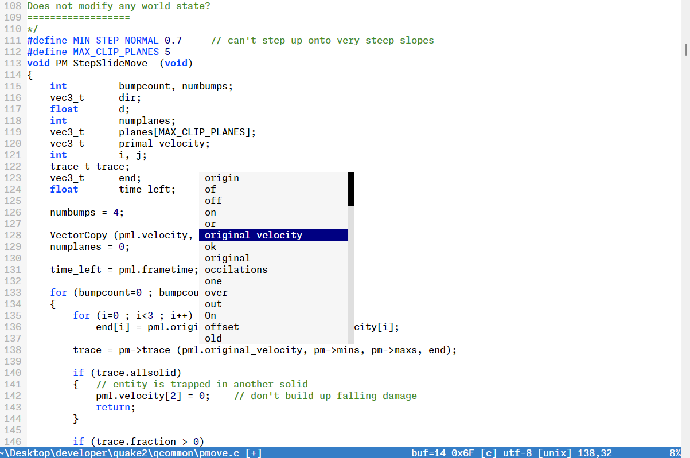
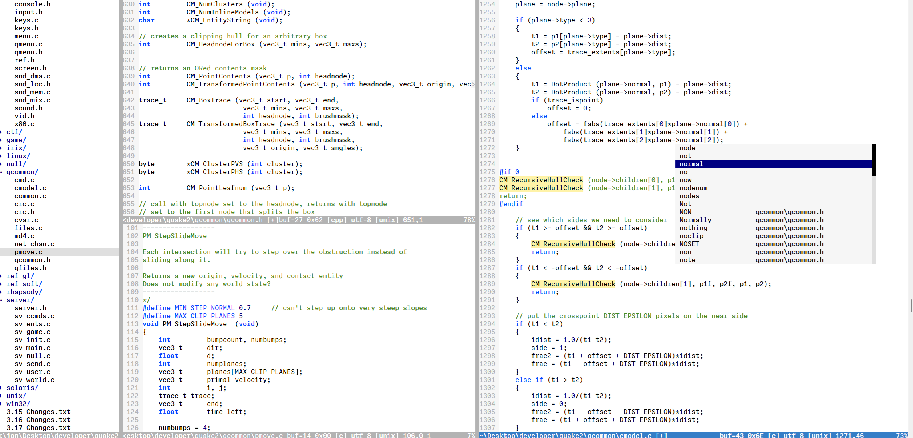

# Studio98 (a Vim/Neovim/VS Code colorscheme)

Install: [](https://marketplace.visualstudio.com/items?itemName=jan-zwiener.studio98)



Studio98 is a text editor colorscheme inspired by the Visual Studio 6.0 era on Windows 98/NT — back when editors were simple, fast, and got out of the way. It's built for focus, with a bright white background and high-contrast syntax highlighting that makes code instantly readable. No trendy low-contrast themes, no distractions - just clear, sharp text that keeps you locked into the code.

If you learned programming like me in the '90s, these colors will feel familiar. They're wired into muscle memory, making it easy to navigate and think without hesitation.

Studio98 is for those who want a simple, effective color scheme that doesn't fight for attention - because the focus should be on the code, not the editor.

I've also designed it to work on terminals. The contrast remains strong, and nothing disappears into the background. A white background isn't just great for a GUI - it can also work well in a terminal window, making text stand out clearly even in lower-color environments.

## Screenshots


*Font: Monaspace Neon*


*Visual Studio Code*


*Font: Courier New*


*Pop-Up Menu*


*Development Environment*

## Installation of colorscheme

### Vim Manual Installation

1. Download `colors/studio98.vim` and place it in your Vim colors directory:
   ```sh
   mkdir -p ~/.vim/colors
   cp studio98.vim ~/.vim/colors/
   ```
2. Add the following to your `vimrc`:
   ```vim
   colorscheme studio98
   ```
3. Restart Vim

### Neovim Manual Installation

1. Download `colors/studio98.vim` and place it in your Vim colors directory:
   ```sh
    mkdir -p ~/.config/nvim/colors
    cp studio98.vim ~/.config/nvim/colors/
   ```
2. Add the following to your `init.lua`:
   ```vim
   vim.cmd.colorscheme('studio98')
   ```
3. Restart Neovim

### Visual Studio Code

Install:
[](https://marketplace.visualstudio.com/items?itemName=jan-zwiener.studio98)

1. Open the **Extensions** sidebar in VS Code.
2. Search for `Studio98`.
3. Click **Install**.
4. Select the theme via `File > Preferences > Color Theme > Studio98`.

## Modification and Building

This colorscheme was built using **vim-colortemplate** v2, a simple and efficient
way to create Vim colorschemes. If you want to tweak Studio98 or create your
own themes, check it out:

🔗 [vim-colortemplate (v2)](https://github.com/lifepillar/vim-colortemplate/tree/v2)

Important: This project uses the v2 syntax of vim-colortemplate.
Please note that vim-colortemplate has recently moved to a v3 version, which
introduces breaking changes.

The template to generate `studio98.vim` is found in the folder:

    template/studio98.colortemplate

Load the `vim-colortemplate` plugin and then load and edit `studio98.colortemplate`.
Build a new version of `studio98.vim` with this command:

    :Colortemplate!

Don't modify `studio98.vim` directly.

## Author

2025-2026 Jan Zwiener

